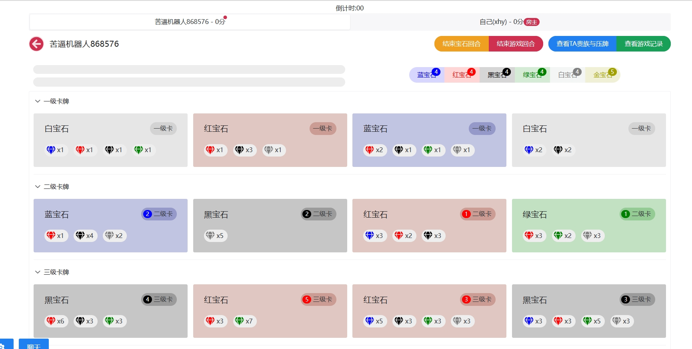
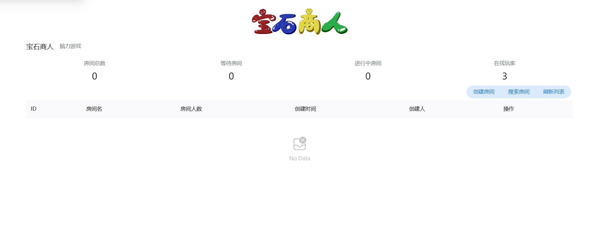

# 宝石商人 - Xhy

## 介绍

我们将宝石商人这款桌游从线下搬到了线上，但我们只有前端以及后端且不是专业的游戏开发，在页面以及交互上会可能会有缺陷。

技术栈: vue3，ts，native ui，websocket

[后端地址](https://gitee.com/XhyQAQ/gemstone-merchant)

[前端地址](https://github.com/LiusCraft/JewelerGame)

[游玩规则讲解]([https://github.com/LiusCraft/JewelerGame](https://www.bilibili.com/video/BV1kP411C7n1))

## 游玩地址
[宝石商人](http://gem.xhystudy.cn/#/)

## 图片

## 功能

**我们在保留原有的功能下提供了拓展功能:**

**保持的原有功能:**

1.根据人数进行游玩规则

2.可用黄金宝石当听牌

3.抵达15分即可胜利

4.等原有功能都有

**提供的拓展功能:**

1.60秒倒计时，超过则跳过该回合

2.快速喊话：快点吧，我等的花谢了 （需要换源）

3.聊天功能: 会不会玩？  (不会携带语音播报)

4.添加智障机器人,一人游玩也能开游戏。(真的很智障)

5.当回合时间低于30秒激昂的音乐将会伴随 (需要换源)

6.关闭页面超过200秒将会被系统删除

7.掉线重连

8.游戏操作日志

## 框架选型

JDK1.8

SpringBoot+Netty

## 游玩事项

1.在一个回合内既可以拿取宝石也可以根据宝石换取卡牌，不过顺序是：拿宝石->换卡牌

2.拿取宝石时/不拿取宝石，如果要结束拿取宝石需要点击 **结束宝石回合**

3.在换卡牌的时候分为压牌和换牌

​	压牌：需要有黄金的情况下进行压牌，并且黄金既可以压牌也可以听其他宝石

​	换牌：选择宝石分为放下及拿起以及听牌，在黄金听牌后将消耗掉黄金宝石，使用卡牌的宝石可以进行听宝石(这和原有的规则是一样的)

4.点击顶部的玩家名称可以查看其他玩家的宝石/卡牌/规则/压卡牌情况，可根据其他玩家的选择进行策略

5.左下角的设置：

​	1.自动切换玩家(到其他玩家回合时会将卡牌/宝石状况自动切过去) 可关闭

​	2.语音播放声音可关闭

​	3.换牌结束宝石回合(开启后可直接换取卡牌并且跳过宝石回合，不用再手动跳过宝石回合再换牌了)

6.在聊天框中可选择开启聊天提示，这样的话其他玩家嘲讽你就可以不用被看到啦~,当然你也可以猛猛的嘲讽他们

## 技术要点

### 1游戏操作日志

对于游戏内的操作行为添加了操作日志，因系统是基于内存，因此采用了软引用解决游戏操作日志过多OOM的问题(现在知道软引用的场景了吧？拿去和面试官battle)

### 2.超过时间则自动跳过当前回合

每个回合默认60秒思考时间，如果超过则跳过当前回合,实现方式是当游戏开始或者到当前玩家时将游戏放入延迟队列中,如果超过了60秒则将利用游戏内的玩家信息进行跳过回合。如果在时间范围内到了下一个玩家手里则将在延迟队列中删除并且再次加入该游戏到延迟队列中，重复即可。

### 3.掉线重连

在玩家输入名字的时候netty将绑定连接，当前ip以及用户id进行绑定通道以及记录ip和userId的关系。

在玩家关闭浏览器的时候触发WebSocketHandler#handlerRemoved()将当前IP放入延迟队列当中，如果超过200秒没有重连则使用ip获取用户id再获取通道进行删除信息，如果在期间回来的话，客户端会间断发送心跳删除在延迟队列中的信息(如果有的话)

**为什么要这样做?**

因为玩家每次刷新页面等操作netty获取的 Channel 都不是同一个，因此只有userId绑定Channel的映射关系，没有Channel 绑定 userId。并且在WebSocketHandler#handlerRemoved()无法获取userId来获取绑定的通道并且关闭，因此采用了IP来进行绑定关联

### 4.智障机器人

智障机器人采用的是贪心算法根据最优策略获取宝石进行换取卡牌，但是走的是系统逻辑，并不是Netty的一套逻辑，这里当时写的时候匆忙了，根据当时想法是采用新手和王者机器人。新手机器人只会过根据最优策略拿宝石，而王者机器人不仅有新手机器人的功能也会采取场上其他玩家的情况卡宝石，不让玩家赢得情况下自己赢，尽量让王者机器人变为有思考的玩家。但是仅实现了新手机器人

## 最后

该项目是当时的前端快速上手项目，本人没系统学过前端，可能在编写上不规范，欢迎大佬提交issue

 **如果这个项目你很喜欢，可以给我👍吗** 
